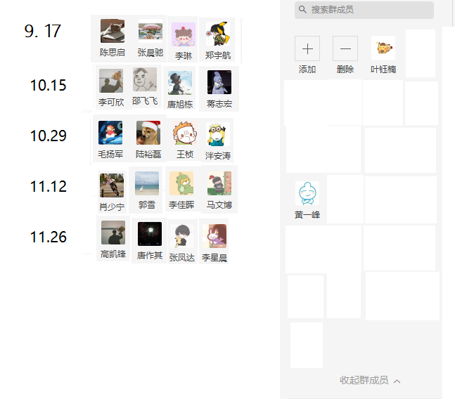

# Seminar 
- Slides are available at this [link](https://pan.zju.edu.cn/share/a1aa33039d1f4bf04246b3c193) (ZJU Cloud, ZJU members only)  

## Next seminar (29-th) ~~2022.1.7~~  2022.1.14

- Lin Li
- Yuhang Zheng
- Zhihong Jiang
- Feifei Shao

## 28-th seminar 12.24

- Zhefu song, End-to-End Object Detection with Fully Convolutional Network (2021 CVPR)
- Chenchi Zhang, Visual grounding via accumulated attention CVPR2018
- Siqi Chen, Context-aware Scene Graph Generation with Seq2Seq Transformers  ICCV2021
- Hanrong Shi, Decoupling Representation and Classifier for Long-Tailed Recognition ICLR2020

## 27-th seminar (27-th) ~~11.26~~ 12.10

- Kaifeng Gao
  - Open-vocabulary Object Detection via Vision and Language Knowledge Distillation ICLR20
- Xinchen Li, 
  - Learning to Generate Scene Graph from Natural Language Supervision, 
  - Linguistic Structures as Weak Supervision for Visual Scene Graph Generation

- Jiahui Li
- Fengda Zhang, Fair Generative Modeling
  - FairGAN: Fairness-aware Generative Adversarial Networks

##  26-th seminar  11.12

- Xue Guo,  Charge prediction modeling with interpretation enhancement driven by double-layer criminal system
- Wenbo Ma,  Detector-Free Weakly Supervised Grounding by Separation
- Shaoning Xiao,  NExT-QA: Next Phase of Question-Answering to Explaining Temporal Action
- Jiahui Li

## 25-th seminar 10.29
- Yangjun Mao
- Yulei Lu
- Zhen Wang
- Antao Pan

